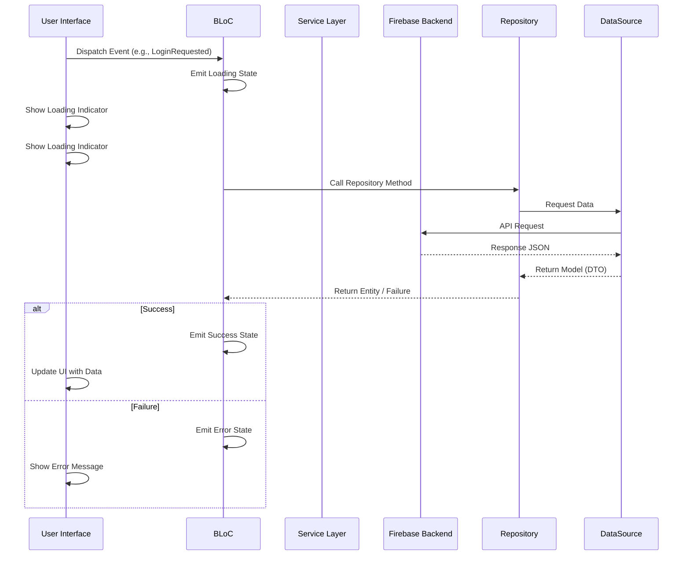
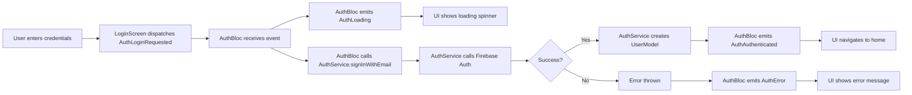
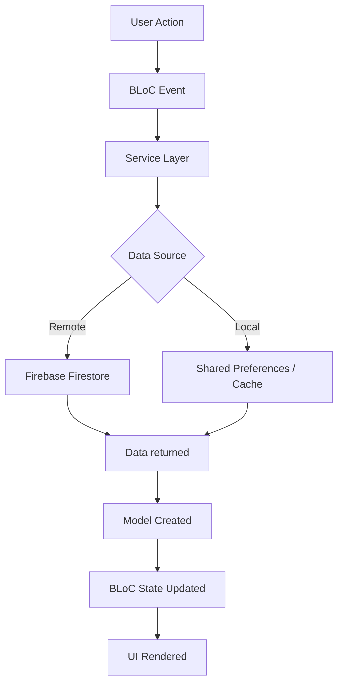

# Architecture Documentation

## Table of Contents
- [Overview](#overview)
- [Application Architecture](#application-architecture)
- [BLoC Pattern Implementation](#bloc-pattern-implementation)
- [Data Flow](#data-flow)
- [Project Structure](#project-structure)
- [Key Components](#key-components)
- [Design Decisions](#design-decisions)

---

## Overview

The Home Repair App is built using **Flutter** with a **Clean Architecture** approach and the **BLoC (Business Logic Component) pattern** for state management. The architecture separates concerns into distinct layers, making the application maintainable, testable, and scalable.

### High-Level Architecture

```mermaid
graph TB
    subgraph "Presentation Layer (UI & Logic)"
        UI[Screens & Widgets]
        BLoC[BLoC Components]
    end
    
    subgraph "Domain Layer (Business Rules)"
        Entities[Entities]
        ReposInterfaces[Repository Interfaces]
        UseCases[Use Cases]
    end
    
    subgraph "Data Layer (Implementation)"
        ReposImpl[Repository Implementations]
        DataSources[Data Sources]
        Models[Data Models (DTOs)]
    end
    
    subgraph "External"
        Firebase[(Firebase Backend)]
        APIs[External APIs]
    end
    
    UI --> BLoC
    BLoC --> UseCases
    BLoC --> ReposInterfaces
    UseCases --> ReposInterfaces
    ReposImpl ..|> ReposInterfaces
    ReposImpl --> DataSources
    DataSources --> Firebase
    DataSources --> Models
    Models ..|> Entities
```

### Technology Stack

- **Frontend Framework**: Flutter 3.9.2+
- **State Management**: BLoC (flutter_bloc)
- **Dependency Injection**: get_it + injectable
- **Navigation**: go_router
- **Backend**: Firebase (Auth, Firestore, Storage, Analytics, Crashlytics)
- **Localization**: easy_localization
- **Maps**: Google Maps Flutter

---

## Application Architecture

The app follows **Clean Architecture** principles with three main layers:

### 1. Presentation Layer

**Location**: `lib/presentation/`

- **Responsibility**: UI rendering and state management.
- **Components**:
  - **Screens**: `lib/presentation/screens/`
  - **Widgets**: `lib/presentation/widgets/`
  - **BLoCs**: `lib/presentation/blocs/` (State Management)
- **Pattern**: BLoC pattern using `flutter_bloc`.

### 2. Domain Layer

**Location**: `lib/domain/`

- **Responsibility**: Pure business logic and enterprise rules. Independent of Flutter and external frameworks.
- **Components**:
  - **Entities**: Core business objects (e.g., `UserEntity`).
  - **Repositories (Interfaces)**: Contracts for data operations (e.g., `IAuthRepository`).
  - **Use Cases**: Encapsulate specific business actions (optional/in-progress).
  - **Failures**: Domain-specific error handling.

### 3. Data Layer

**Location**: `lib/data/`

- **Responsibility**: Data retrieval and transformation.
- **Components**:
  - **Repositories (Implementation)**: `lib/data/repositories/` (Implements Domain interfaces).
  - **Data Sources**: `lib/data/datasources/` (Direct access to API/Db).
  - **Models**: `lib/data/models/` (JSON serialization/DTOs, extends Entities).
- **Pattern**: Repository Pattern.

### Supporting Layers

**Core** (`lib/core/`):
- Dependency Injection (`get_it`, `injectable`)
- Constants, Utilities, Formatters

**Configuration** (`lib/config/`):
- Flavor-specific configurations (Dev, Stg, Prod)
- Firebase options
- Theme & Router

---

## BLoC Pattern Implementation

The BLoC pattern separates business logic from UI, making code testable and maintainable.

### BLoC Flow Diagram



### BLoC Components

#### Events
User actions or system triggers that cause state changes.

**Example**: `AuthEvent` (from `lib/blocs/auth/`)
```dart
abstract class AuthEvent extends Equatable {}

class AuthLoginRequested extends AuthEvent {
  final String email;
  final String password;
}

class AuthLogoutRequested extends AuthEvent {}
```

#### States
Represent the current state of the application.

**Example**: `AuthState` (from `lib/blocs/auth/`)
```dart
abstract class AuthState extends Equatable {}

class AuthInitial extends AuthState {}
class AuthLoading extends AuthState {}
class AuthAuthenticated extends AuthState {
  final UserModel user;
}
class AuthError extends AuthState {
  final String message;
}
```

#### BLoCs
Process events and emit states based on business logic.

**Example**: `AuthBloc` (from `lib/blocs/auth/`)
```dart
class AuthBloc extends Bloc<AuthEvent, AuthState> {
  final AuthService authService;
  
  AuthBloc({required this.authService}) : super(AuthInitial()) {
    on<AuthLoginRequested>(_onLoginRequested);
    on<AuthLogoutRequested>(_onLogoutRequested);
  }
  
  Future<void> _onLoginRequested(
    AuthLoginRequested event,
    Emitter<AuthState> emit,
  ) async {
    emit(AuthLoading());
    try {
      final user = await authService.signInWithEmail(
        event.email,
        event.password,
      );
      emit(AuthAuthenticated(user: user));
    } catch (e) {
      emit(AuthError(message: e.toString()));
    }
  }
}
```

### BLoC Modules

The app organizes BLoCs by feature:

| BLoC | Purpose | Location |
|------|---------|----------|
| **AuthBloc** | User authentication | `lib/presentation/blocs/auth/` |
| **ServiceBloc** | Service catalog browsing | `lib/presentation/blocs/service/` |
| **BookingBloc** | Booking flow management | `lib/presentation/blocs/booking/` |
| **OrderBloc** | Customer order management | `lib/presentation/blocs/order/` |
| **ProfileBloc** | User profile management | `lib/presentation/blocs/profile/` |
| **TechnicianDashboardBloc** | Technician statistics | `lib/presentation/blocs/technician_dashboard/` |
| **AdminBloc** | Admin panel operations | `lib/presentation/blocs/admin/` |
| **AddressBookBloc** | Saved addresses | `lib/presentation/blocs/address_book/` |

---

## Data Flow

### Complete Data Flow Example: User Login



### State Management Flow

1. **User Action**: User interacts with UI (tap button, enter text)
2. **Event Dispatch**: Widget dispatches event to BLoC via `context.read<BLoC>().add(Event())`
3. **State Emission**: BLoC processes event and emits new state
4. **UI Reaction**: Widget wrapped in `BlocBuilder` or `BlocListener` reacts to state
5. **UI Update**: UI rebuilds based on new state

### Data Persistence Flow



---

## Project Structure

```
```
lib/
├── config/                     # App configuration
│   ├── firebase_options.dart   # Firebase platform configs
│   ├── routes.dart             
│   └── theme.dart
│
├── core/                       # Core utilities
│   ├── constants/              # App constants
│   ├── errors/                 # Failures & Exceptions
│   └── injection/              # Dependency injection (get_it)
│
├── data/                       # Data Layer
│   ├── datasources/            # Remote & Local Data Sources
│   ├── models/                 # Data Models (DTOs)
│   └── repositories/           # Repository Implementations
│
├── domain/                     # Domain Layer
│   ├── entities/               # Business Entities
│   ├── repositories/           # Repository Interfaces
│   └── usecases/               # Business Logic Use Cases
│
├── presentation/               # Presentation Layer
│   ├── blocs/                  # BLoC State Management
│   ├── screens/                # UI Screens
│   │   ├── auth/
│   │   ├── customer/
│   │   ├── technician/
│   │   └── admin/
│   └── widgets/                # Reusable UI Components
│
├── router/                     # Navigation
│   └── app_router.dart         # GoRouter configuration
│
├── services/                   # External Services Wrapper (Legacy/Utils)
│
├── utils/                      # General Utils (Formatters, Validators)
│
├── flavors.dart                # Flavor Definitions
├── main.dart                   # Default Entry
├── main_dev.dart               # Dev Entry
├── main_prod.dart              # Prod Entry
└── main_stg.dart               # Staging Entry
```

---

## Key Components

### 1. Authentication System

**Components**:
- `AuthBloc` - Manages authentication state
- `AuthService` - Interfaces with Firebase Auth
- `UserModel` - Represents authenticated user

**Features**:
- Email/password authentication
- Google Sign-In
- Facebook authentication (implemented but not used)
- Multi-role support (customer, technician, admin)

### 2. Service Catalog

**Components**:
- `ServiceBloc` - Manages service browsing
- `FirestoreService` - Fetches services from Firestore
- `ServiceModel` - Service data structure
- `CacheService` - Caches services locally (24-hour TTL)

**Features**:
- Browse all services
- Search services
- Filter by category
- Offline caching

### 3. Booking System

**Components**:
- `BookingBloc` - Manages booking flow
- `OrderModel` - Order data structure
- `AddressBookBloc` - Saved addresses
- Map integration with `MapLocationPicker`

**Features**:
- Multi-step booking flow
- Address selection (saved or map-based)
- Date/time scheduling
- Order confirmation

### 4. Order Management

**Components**:
- `CustomerOrderBloc` - Customer order tracking
- `TechnicianOrderBloc` - Technician job management
- `OrderProvider` - Real-time order updates
- `FirestoreService` - Order CRUD operations

**Features**:
- Real-time order status updates
- Pagination for large order lists
- Order filtering and sorting
- Status transitions (pending → confirmed → in_progress → completed)

### 5. Real-Time Chat

**Components**:
- `ChatService` - Firestore real-time listeners
- `ChatModel` - Conversation metadata
- `MessageModel` - Individual messages

**Features**:
- Real-time messaging between customer and technician
- Message timestamps
- Read/unread status
- Order-specific chats

### 6. Reviews & Ratings

**Components**:
- `ReviewService` - Review CRUD operations
- `ReviewModel` - Review data with ratings
- Rating aggregation in `TechnicianModel`

**Features**:
- 5-star rating system
- Text reviews with optional photos
- Multiple rating categories (quality, professionalism, value)
- Aggregate ratings on technician profiles

### 7. Admin Dashboard

**Components**:
- `AdminBloc` - Admin operations
- `DashboardStats` - Platform statistics
- Admin screens for user/service management

**Features**:
- User management (view, edit, delete)
- Service management (CRUD operations)
- Platform analytics
- Revenue tracking

---

## Design Decisions

### 1. Why BLoC Pattern?

**Chosen over**: Provider, Riverpod, MobX

**Reasons**:
- **Separation of Concerns**: Clear separation between UI and business logic
- **Testability**: BLoCs are pure Dart classes, easy to unit test
- **Predictability**: Unidirectional data flow makes debugging easier
- **Scalability**: Well-suited for large apps with complex state
- **Flutter Team Endorsed**: Official state management solution

**Tradeoffs**:
- More boilerplate code compared to Provider
- Steeper learning curve for beginners
- Requires more files per feature (event, state, bloc)

### 2. Why Firebase?

**Chosen over**: Custom backend, Supabase, AWS Amplify

**Reasons**:
- **Rapid Development**: Pre-built authentication, database, storage
- **Real-Time Capabilities**: Firestore offers real-time listeners out of the box
- **Scalability**: Automatic scaling without infrastructure management
- **Integrated Services**: Analytics, Crashlytics, Cloud Messaging in one ecosystem
- **Security**: Firestore Security Rules for fine-grained access control

**Tradeoffs**:
- Vendor lock-in
- Costs can scale with usage
- Limited complex query capabilities
- Offline support requires careful design

### 3. Why GoRouter over Navigator 2.0?

**Reasons**:
- **Declarative Routing**: Define routes in a single configuration
- **Deep Linking**: Built-in support for web URLs
- **Type Safety**: Type-safe route parameters
- **Redirection**: Easy authentication-based redirects
- **Nested Navigation**: Support for tab-based and drawer navigation

### 4. Clean Architecture Approach

**Reasoning**:
- **Maintainability**: Clear boundaries between layers
- **Testability**: Each layer can be tested independently
- **Flexibility**: Easy to swap out implementations (e.g., switch from Firebase to another backend)
- **Scalability**: Structure supports growth without becoming messy

**Current State**: Partially implemented
- ✅ Presentation layer fully separated
- ✅ Business logic in BLoCs
- ✅ Data layer abstraction (Repository managed)
- ✅ Domain layer defined (Entities & Interfaces)

### 5. Dependency Injection with get_it + injectable

**Chosen over**: Provider-based DI, manual injection

**Reasons**:
- **Decoupling**: Services not tied to widget tree
- **Testability**: Easy to mock dependencies
- **Code Generation**: `injectable` generates registration code
- **Performance**: Service locator pattern is fast

**Implementation**: Located in `lib/core/injection/`

### 6. Localization with easy_localization

**Reasoning**:
- **Simplicity**: JSON-based translations are easy to manage
- **RTL Support**: Built-in right-to-left language support (for Arabic)
- **Hot Reload**: Translation changes reflect immediately during development
- **Plural Support**: Handles plural forms correctly

**Supported Languages**: English (en), Arabic (ar)

### 7. Multi-Environment Support (Flavors)

**Structure**:
- `main_dev.dart`: Development (separate Firebase project, logging enabled)
- `main_stg.dart`: Staging (for QA testing)
- `main_prod.dart`: Production (live data, optimized)

**Benefits**:
- **Isolation**: Risk-free development and testing.
- **Configuration**: Different API keys and endpoints per environment.
- **Parallel Installation**: Can install Dev and Prod apps on the same device.

---

## Future Architectural Improvements

Based on `COMPREHENSIVE_ANALYSIS.md`, recommended enhancements:

### 1. Use Cases / Interactors
- **Current**: Business logic in BLoCs calling Repositories directly.
- **Target**: Extract complex logic into use cases.
- **Benefits**: Reusable business logic, cleaner BLoCs.

### 3. Centralized Asset Management
- **Current**: Asset paths as strings scattered in code
- **Target**: `AppAssets` class with constants or code generation
- **Benefits**: Type safety, fewer runtime errors

### 4. Enhanced Error Handling
- **Current**: Try-catch in BLoCs with generic error states
- **Target**: Centralized error handling with custom exceptions
- **Benefits**: Consistent error UX, easier debugging

---

## Useful Resources

- [BLoC Pattern Official Docs](https://bloclibrary.dev/)
- [Flutter Clean Architecture](https://github.com/ResoCoder/flutter-tdd-clean-architecture-course)
- [Firebase for Flutter](https://firebase.google.com/docs/flutter/setup)
- [GoRouter Documentation](https://pub.dev/packages/go_router)
- [Injectable DI](https://pub.dev/packages/injectable)

---

**Last Updated**: December 2025  
**Version**: 1.0.0
