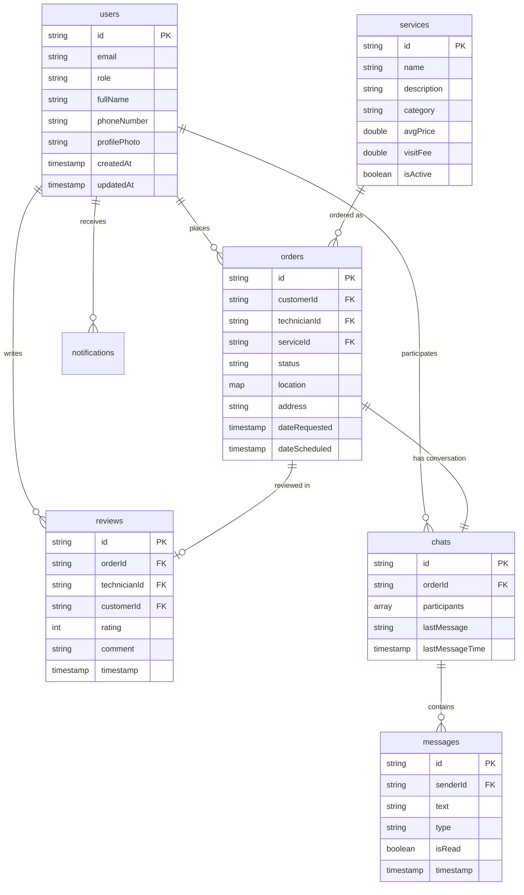

# Firestore Database Schema

## Table of Contents
- [Overview](#overview)
- [Collections Structure](#collections-structure)
- [Data Relationships](#data-relationships)
- [Security Rules Summary](#security-rules-summary)
- [Indexes](#indexes)
- [Query Examples](#query-examples)

---

## Overview

The Home Repair App uses **Cloud Firestore** as its primary database. The database follows a **denormalized** data model for optimal read performance, with some strategic normalization for data integrity.

###  Database Diagram



---

## Collections Structure

### 1. users

**Path**: `/users/{userId}`

Stores user profiles for customers, technicians, and admins.

| Field | Type | Required | Description |
|-------|------|----------|-------------|
| `id` | string | ✅ | User unique identifier (matches Firebase Auth UID) |
| `email` | string | ✅ | User email address (validated) |
| `fullName` | string | ✅ | Display name (2-50 characters) |
| `role` | string | ✅ | User role: `'customer'`, `'technician'`, or `'admin'` |
| `phoneNumber` | string | ❌ | Phone number (10-15 digits when present) |
| `profilePhoto` | string | ❌ | URL to profile image in Firebase Storage |
| `createdAt` | timestamp | ✅ | Account creation timestamp |
| `updatedAt` | timestamp | ✅ | Last profile update timestamp |
| `lastActive` | timestamp | ✅ | Last activity timestamp |
| `emailVerified` | boolean | ❌ | Email verification status |

**Indexes**: 
- Single field: `role` (ASC)
- Composite: `role` (ASC) + `createdAt` (DESC)

**Access Control**:
- **Read**: Any authenticated user (for browsing technicians)
- **Create**: Self-signed-up users only, must match auth UID
- **Update**: Owners can update limited fields (name, phone, address, photo); admins can update anything
- **Delete**: Admins only

**Example Document**:
```json
{
  "id": "user123",
  "email": "john.doe@example.com",
  "fullName": "John Doe",
  "role": "customer",
  "phoneNumber": "+966501234567",
  "profilePhoto": "https://storage.googleapis.com/...",
  "createdAt": "2025-11-01T10:00:00Z",
  "updatedAt": "2025-11-15T14:30:00Z",
  "lastActive": "2025-12-01T09:00:00Z",
  "emailVerified": true
}
```

---

### 2. services

**Path**: `/services/{serviceId}`

Catalog of repair services offered on the platform.

| Field | Type | Required | Description |
|-------|------|----------|-------------|
| `id` | string | ✅ | Service unique identifier |
| `name` | string | ✅ | Service name (2-50 characters) |
| `description` | string | ✅ | Service description (10-1000 characters) |
| `iconUrl` | string | ✅ | URL to service icon/image |
| `category` | string | ✅ | Service category (e.g., "Plumbing", "Electrical") |
| `avgPrice` | double | ✅ | Average service price |
| `minPrice` | double | ✅ | Minimum price range |
| `maxPrice` | double | ✅ | Maximum price range |
| `visitFee` | double | ✅ | Technician visit/inspection fee |
| `avgCompletionTimeMinutes` | int | ✅ | Average completion time in minutes |
| `isActive` | boolean | ✅ | Service availability status |
| `createdAt` | timestamp | ✅ | Service creation timestamp |

**Indexes**: 
- Single field: `category` (ASC), `isActive` (ASC)
- Composite: `isActive` (ASC) + `category` (ASC) + `avgPrice` (ASC)

**Access Control**:
- **Read**: Public (even unauthenticated users can browse services)
- **Create**: Admins only
- **Update**: Admins only
- **Delete**: Admins only

**Example Document**:
```json
{
  "id": "service001",
  "name": "AC Repair",
  "description": "Professional air conditioning repair and maintenance service",
  "iconUrl": "https://storage.googleapis.com/icons/ac.png",
  "category": "HVAC",
  "avgPrice": 250.0,
  "minPrice": 150.0,
  "maxPrice": 500.0,
  "visitFee": 50.0,
  "avgCompletionTimeMinutes": 90,
  "isActive": true,
  "createdAt": "2025-10-15T08:00:00Z"
}
```

---

### 3. orders

**Path**: `/orders/{orderId}`

Service orders placed by customers.

| Field | Type | Required | Description |
|-------|------|----------|-------------|
| `id` | string | ✅ | Order unique identifier |
| `customerId` | string | ✅ | Customer user ID (FK to users) |
| `technicianId` | string | ❌ | Assigned technician ID (FK to users) |
| `serviceId` | string | ✅ | Service ID (FK to services) |
| `description` | string | ✅ | Problem description provided by customer |
| `photoUrls` | array(string) | ✅ | Photo URLs showing the problem (can be empty) |
| `location` | map | ✅ | GeoPoint as map: `{latitude: double, longitude: double}` |
| `address` | string | ✅ | Full address string |
| `dateRequested` | timestamp | ✅ | When order was created |
| `dateScheduled` | timestamp | ❌ | Scheduled appointment date/time |
| `status` | string | ✅ | Order status (see enum below) |
| `initialEstimate` | double | ❌ | Initial price estimate |
| `finalPrice` | double | ❌ | Final agreed price |
| `visitFee` | double | ✅ | Visit/inspection fee |
| `vat` | double | ✅ | VAT amount |
| `paymentMethod` | string | ✅ | Payment method: `'cash'`, `'card'`, `'wallet'` |
| `paymentStatus` | string | ✅ | Payment status: `'pending'`, `'paid'`, `'failed'` |
| `notes` | string | ❌ | Additional notes |
| `serviceName` | string | ❌ | **Denormalized** - Service name for quick display |
| `customerName` | string | ❌ | **Denormalized** - Customer name for quick display |
| `customerPhoneNumber` | string | ❌ | **Denormalized** - Customer phone for quick contact |
| `createdAt` | timestamp | ✅ | Order creation timestamp |
| `updatedAt` | timestamp | ✅ | Last update timestamp |

**Order Status Enum**:
- `pending` - Order placed, awaiting technician
- `accepted` - Technician accepted the order
- `traveling` - Technician en route to location
- `arrived` - Technician arrived at location
- `working` - Work in progress
- `completed` - Work completed successfully
- `cancelled` - Order cancelled

**Indexes**: 
- Composite: `customerId` (ASC) + `status` (ASC) + `createdAt` (DESC)
- Composite: `technicianId` (ASC) + `status` (ASC) + `dateScheduled` (DESC)
- Single field: `status` (ASC), `dateScheduled` (ASC)

**Access Control**:
- **Read**: Order participants (customer, technician) or admins
- **Create**: Customers only; new orders must have status `'pending'`
- **Update**: Customers can update limited fields (status, notes); technicians can update status and completion notes; admins can update anything
- **Delete**: Admins only

**Example Document**:
```json
{
  "id": "order001",
  "customerId": "user123",
  "technicianId": "tech456",
  "serviceId": "service001",
  "description": "AC not cooling properly, making strange noises",
  "photoUrls": ["https://storage.googleapis.com/photos/ac1.jpg"],
  "location": {"latitude": 24.7136, "longitude": 46.6753},
  "address": "123 King Fahd Road, Riyadh, Saudi Arabia",
  "dateRequested": "2025-12-01T10:00:00Z",
  "dateScheduled": "2025-12-03T14:00:00Z",
  "status": "confirmed",
  "initialEstimate": 300.0,
  "finalPrice": null,
  "visitFee": 50.0,
  "vat": 15.0,
  "paymentMethod": "cash",
  "paymentStatus": "pending",
  "notes": "Prefer afternoon appointments",
  "serviceName": "AC Repair",
  "customerName": "John Doe",
  "customerPhoneNumber": "+966501234567",
  "createdAt": "2025-12-01T10:00:00Z",
  "updatedAt": "2025-12-01T12:00:00Z"
}
```

---

### 4. reviews

**Path**: `/reviews/{reviewId}`

Customer reviews for completed services.

| Field | Type | Required | Description |
|-------|------|----------|-------------|
| `id` | string | ✅ | Review unique identifier |
| `orderId` | string | ✅ | Order ID (FK to orders) |
| `technicianId` | string | ✅ | Technician ID (FK to users) |
| `customerId` | string | ✅ | Customer ID (FK to users) |
| `rating` | int | ✅ | Overall rating (1-5 stars) |
| `comment` | string | ✅ | Review text (10-500 characters) |
| `categories` | map(string, int) | ✅ | Category ratings: `{quality, punctuality, professionalism, price}` |
| `photoUrls` | array(string) | ✅ | Photo URLs (max 5 photos, can be empty) |
| `timestamp` | timestamp | ✅ | Review creation timestamp |
| `qualityRating` | int | ❌ | Quality rating (1-5) |
| `professionalismRating` | int | ❌ | Professionalism rating (1-5) |
| `punctualityRating` | int | ❌ | Punctuality rating (1-5) |
| `valueRating` | int | ❌ | Value for money rating (1-5) |

**Indexes**: 
- Composite: `technicianId` (ASC) + `timestamp` (DESC)
- Composite: `orderId` (ASC)
- Single field: `rating` (ASC)

**Access Control**:
- **Read**: Public (anyone can read reviews)
- **Create**: Customers only; must be the order owner; all ratings must be 1-5
- **Update**: Customers can edit their own reviews within 24 hours of creation
- **Delete**: Customers can delete within 24 hours; admins can delete anytime

**Example Document**:
```json
{
  "id": "review001",
  "orderId": "order001",
  "technicianId": "tech456",
  "customerId": "user123",
  "rating": 5,
  "comment": "Excellent service! Very professional and fixed the issue quickly.",
  "categories": {
    "quality": 5,
    "punctuality": 4,
    "professionalism": 5,
    "price": 4
  },
  "photoUrls": ["https://storage.googleapis.com/reviews/photo1.jpg"],
  "timestamp": "2025-12-05T16:00:00Z"
}
```

---

### 5. chats

**Path**: `/chats/{chatId}`

Chat conversations between customers and technicians for specific orders.

| Field | Type | Required | Description |
|-------|------|----------|-------------|
| `id` | string | ✅ | Chat unique identifier |
| `orderId` | string | ✅ | Associated order ID (FK to orders) |
| `participants` | array(string) | ✅ | Array of exactly 2 user IDs (customer + technician) |
| `lastMessage` | string | ❌ | Preview of last message (max 500 chars) |
| `lastMessageTime` | timestamp | ❌ | Timestamp of last message |
| `unreadCounts` | map(string, int) | ✅ | Unread message count per user: `{userId: count}` |
| `createdAt` | timestamp | ✅ | Chat creation timestamp |

**Indexes**: 
- Array-contains: `participants` (ASC) + `lastMessageTime` (DESC)

**Access Control**:
- **Read**: Participants only (or admins)
- **Create**: Participants only; must have exactly 2 participants
- **Update**: Participants can update metadata (last message, timestamps, unread counts)
- **Delete**: Immutable - cannot be deleted

**Example Document**:
```json
{
  "id": "chat001",
  "orderId": "order001",
  "participants": ["user123", "tech456"],
  "lastMessage": "I'll arrive at 2 PM",
  "lastMessageTime": "2025-12-03T13:45:00Z",
  "unreadCounts": {
    "user123": 1,
    "tech456": 0
  },
  "createdAt": "2025-12-01T11:00:00Z"
}
```

#### Subcollection: messages

**Path**: `/chats/{chatId}/messages/{messageId}`

Individual chat messages within a conversation.

| Field | Type | Required | Description |
|-------|------|----------|-------------|
| `id` | string | ✅ | Message unique identifier |
| `senderId` | string | ✅ | Sender user ID (FK to users) |
| `text` | string | ✅ | Message text (1-1000 characters) |
| `timestamp` | timestamp | ✅ | Message sent timestamp |
| `type` | string | ✅ | Message type: `'text'` or `'image'` |
| `isRead` | boolean | ✅ | Read status (initially false) |
| `imageUrl` | string | ❌ | Image URL (required if type is `'image'`) |

**Indexes**: 
- Composite: `timestamp` (ASC)

**Access Control**:
- **Read**: Chat participants only
- **Create**: Chat participants only; sender must be authenticated user
- **Update**: Can only update `isRead` from false to true
- **Delete**: Immutable - cannot be deleted

**Example Document**:
```json
{
  "id": "msg001",
  "senderId": "tech456",
  "text": "I'll arrive at 2 PM tomorrow",
  "timestamp": "2025-12-03T13:45:00Z",
  "type": "text",
  "isRead": true
}
```

---

### 6. notifications

**Path**: `/notifications/{notificationId}`

Push notifications sent to users (typically created by Cloud Functions).

| Field | Type | Required | Description |
|-------|------|----------|-------------|
| `id` | string | ✅ | Notification unique identifier |
| `userId` | string | ✅ | Recipient user ID (FK to users) |
| `title` | string | ✅ | Notification title |
| `body` | string | ✅ | Notification message body |
| `type` | string | ✅ | Type: `'order_update'`, `'new_message'`, `'review'`, etc. |
| `data` | map | ❌ | Additional data (e.g., order ID) |
| `isRead` | boolean | ✅ | Read status |
| `createdAt` | timestamp | ✅ | Notification timestamp |

**Indexes**: 
- Composite: `userId` (ASC) + `isRead` (ASC) + `createdAt` (DESC)

**Access Control**:
- **Read**: User can only read their own notifications
- **Write**: Disabled (only Cloud Functions should write)

**Example Document**:
```json
{
  "id": "notif001",
  "userId": "user123",
  "title": "Order Confirmed",
  "body": "Your AC repair order has been confirmed",
  "type": "order_update",
  "data": {
    "orderId": "order001",
    "status": "confirmed"
  },
  "isRead": false,
  "createdAt": "2025-12-01T12:00:00Z"
}
```

---

## Data Relationships

### One-to-Many Relationships

1. **User → Orders**: One user (customer) can place many orders
   - Query: `orders.where('customerId', '==', userId)`

2. **User → Reviews**: One user (customer) can write many reviews
   - Query: `reviews.where('customerId', '==', userId)`

3. **User → Chats**: One user participates in many chats
   - Query: `chats.where('participants', 'array-contains', userId)`

4. **Service → Orders**: One service can have many orders
   - Query: `orders.where('serviceId', '==', serviceId)`

5. **Order → Messages**: One order has one chat with many messages
   - Query: `chats/{chatId}/messages.orderBy('timestamp')`

### One-to-One Relationships

1. **Order ↔ Chat**: Each order has exactly one chat conversation
   - Query: `chats.where('orderId', '==', orderId).limit(1)`

2. **Order ↔ Review**: Each completed order can have one review
   - Query: `reviews.where('orderId', '==', orderId).limit(1)`

---

## Security Rules Summary

See [firestore.rules](file:///c:/Users/Hassan/.gemini/antigravity/scratch/home_repair_app/firestore.rules) for complete security rules.

### Key Security Principles

1. **Authentication Required**: Most operations require authentication
2. **Role-Based Access**: Different permissions for customers, technicians, and admins
3. **Ownership Validation**: Users can only modify their own data
4. **Field-Level Validation**: Strict validation on field types, lengths, and formats
5. **Status Transitions**: Order status changes are validated
6. **Time Windows**: Reviews can only be edited within 24 hours

### Helper Functions

- `isAuthenticated()` - User is logged in
- `isOwner(userId)` - User owns the resource
- `isAdmin()` - User has admin role
- `isTechnician()` - User has technician role
- `isCustomer()` - User has customer role
- `isValidEmail(email)` - Email format validation
- `isValidRating(rating)` - Rating is 1-5
- `isFutureDate(date)` - Date is in the future

---

## Indexes

Required Firestore indexes for optimal query performance:

### Auto-Generated Indexes
- Single-field indexes are auto-created by Firestore

### Composite Indexes

```javascript
// users collection
{
  collectionGroup: "users",
  fields: [
    { fieldPath: "role", order: "ASCENDING" },
    { fieldPath: "createdAt", order: "DESCENDING" }
  ]
}

// orders collection - customer orders
{
  collectionGroup: "orders",
  fields: [
    { fieldPath: "customerId", order: "ASCENDING" },
    { fieldPath: "status", order: "ASCENDING" },
    { fieldPath: "createdAt", order: "DESCENDING" }
  ]
}

// orders collection - technician orders
{
  collectionGroup: "orders",
  fields: [
    { fieldPath: "technicianId", order: "ASCENDING" },
    { fieldPath: "status", order: "ASCENDING" },
    { fieldPath: "dateScheduled", order: "DESCENDING" }
  ]
}

// reviews collection
{
  collectionGroup: "reviews",
  fields: [
    { fieldPath: "technicianId", order: "ASCENDING" },
    { fieldPath: "timestamp", order: "DESCENDING" }
  ]
}

// chats collection
{
  collectionGroup: "chats",
  fields: [
    { fieldPath: "participants", arrayConfig: "CONTAINS" },
    { fieldPath: "lastMessageTime", order: "DESCENDING" }
  ]
}

// notifications collection
{
  collectionGroup: "notifications",
  fields: [
    { fieldPath: "userId", order: "ASCENDING" },
    { fieldPath: "isRead", order: "ASCENDING" },
    { fieldPath: "createdAt", order: "DESCENDING" }
  ]
}
```

---

## Query Examples

### Get Customer Orders (Paginated)

```dart
// Get first page of customer orders
Query query = FirebaseFirestore.instance
    .collection('orders')
    .where('customerId', isEqualTo: userId)
    .orderBy('createdAt', descending: true)
    .limit(10);

// Get next page
Query nextPage = query.startAfterDocument(lastDocument);
```

### Get Technician Active Orders

```dart
Query query = FirebaseFirestore.instance
    .collection('orders')
    .where('technicianId', isEqualTo: technicianId)
    .where('status', whereIn: ['confirmed', 'in_progress', 'traveling'])
    .orderBy('dateScheduled', descending: false);
```

### Get Technician Reviews

```dart
Query query = FirebaseFirestore.instance
    .collection('reviews')
    .where('technicianId', isEqualTo: technicianId)
    .orderBy('timestamp', descending: true)
    .limit(20);
```

### Get Chat Messages (Real-Time)

```dart
Stream<QuerySnapshot> messageStream = FirebaseFirestore.instance
    .collection('chats')
    .doc(chatId)
    .collection('messages')
    .orderBy('timestamp', descending: false)
    .snapshots();
```

### Get User Unread Notifications

```dart
Query query = FirebaseFirestore.instance
    .collection('notifications')
    .where('userId', isEqualTo: userId)
    .where('isRead', isEqualTo: false)
    .orderBy('createdAt', descending: true);
```

### Search Services by Category

```dart
Query query = FirebaseFirestore.instance
    .collection('services')
    .where('isActive', isEqualTo: true)
    .where('category', isEqualTo: 'Plumbing')
    .orderBy('avgPrice', descending: false);
```

---

## Data Denormalization Strategy

### Why Denormalize?

Firestore pricing is based on reads/writes. Denormalizing common data reduces the number of reads needed.

### Denormalized Fields

1. **In Order Model**:
   - `serviceName` - Avoid reading `services` collection for each order display
   - `customerName` - Technicians can see customer name without extra read
   - `customerPhoneNumber` - Quick contact without extra read

### Tradeoffs

**Benefits**:
- Faster queries (single read instead of multiple)
- Lower Firestore costs
- Better offline support

**Drawbacks**:
- Data can become stale (e.g., if customer changes name)
- More storage space
- Need to update denormalized data when source changes

### Update Strategy

When source data changes, use Cloud Functions to update denormalized copies:

```javascript
// Cloud Function example (pseudo-code)
exports.updateOrderCustomerName = functions.firestore
  .document('users/{userId}')
  .onUpdate(async (change, context) => {
    const newName = change.after.data().fullName;
    const userId = context.params.userId;
    
    // Update all orders with this customer
    const orders = await admin.firestore()
      .collection('orders')
      .where('customerId', '==', userId)
      .get();
      
    const batch = admin.firestore().batch();
    orders.forEach(doc => {
      batch.update(doc.ref, { customerName: newName });
    });
    
    await batch.commit();
  });
```

---

**Last Updated**: December 2025  
**Version**: 1.0.0
